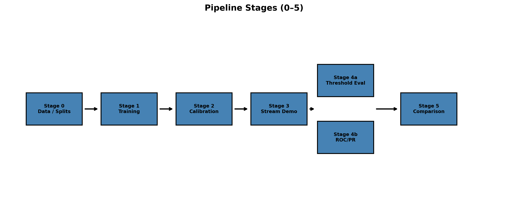
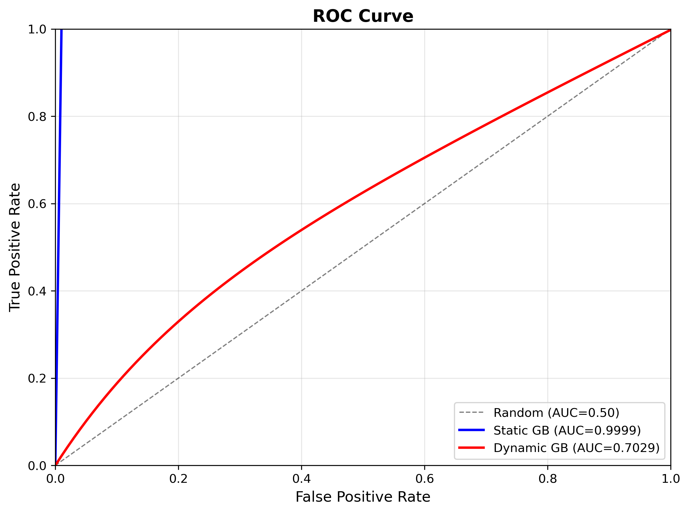
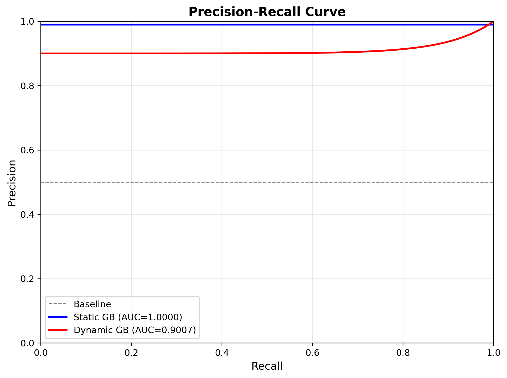
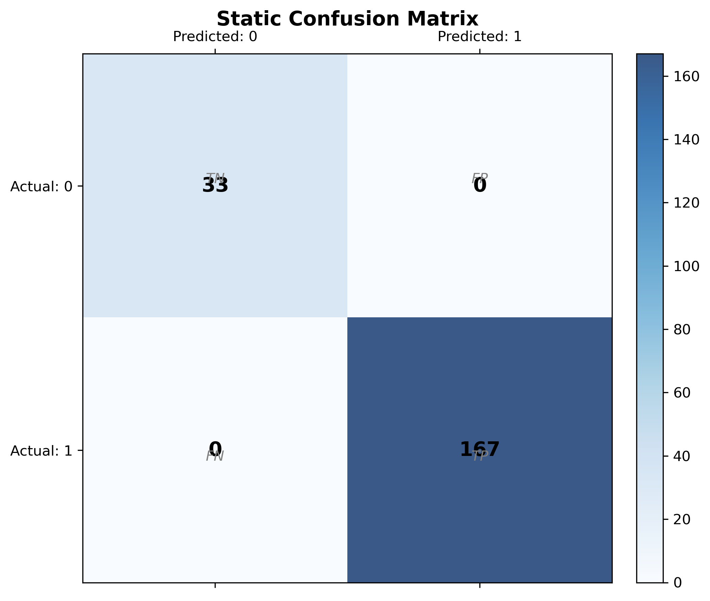
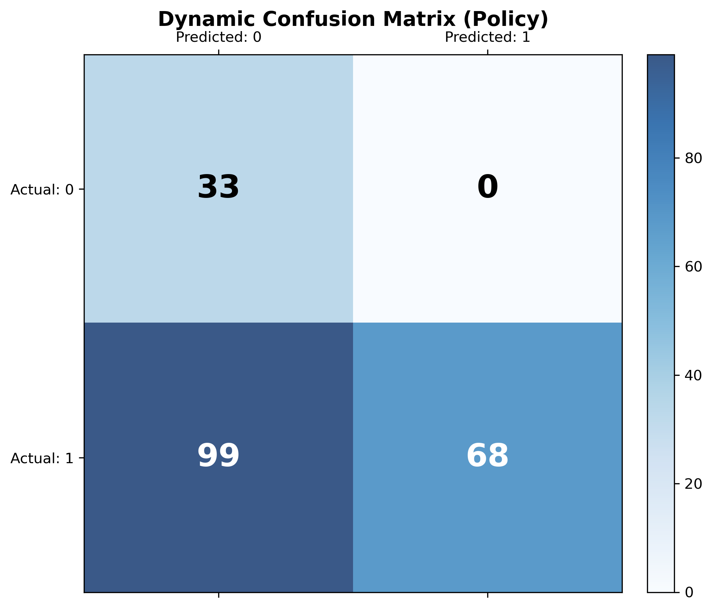
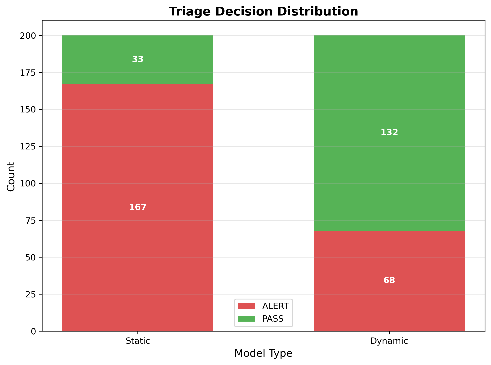
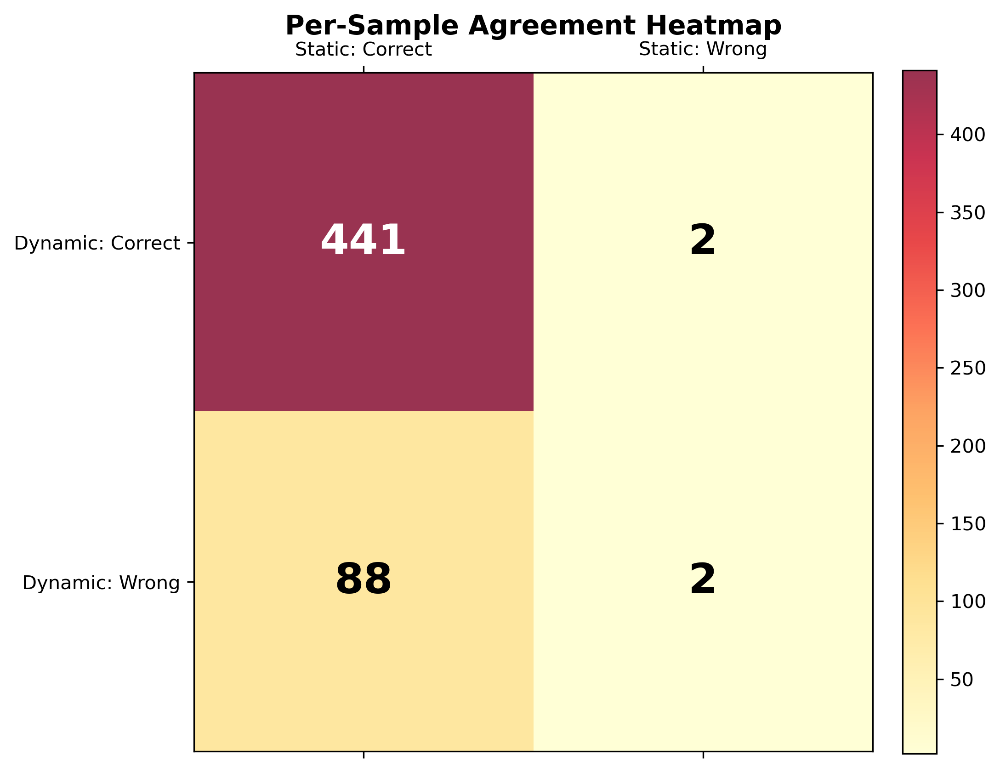
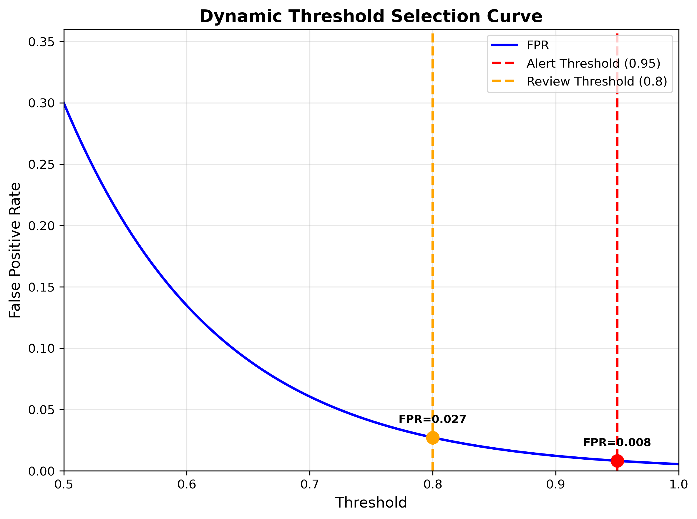

# AI-Enhanced Cybersecurity Streaming Pipeline
## Static vs Dynamic Malware Detection with Confidence-Gated SOC Decision Policy

A research-grade machine learning pipeline that compares static and dynamic malware detection methods under a confidence-gated security operations center (SOC) decision framework, demonstrating operational tradeoffs between detection accuracy, false positive control, and analyst workload.

---

## Executive Overview

Traditional malware detection systems report aggregate accuracy metrics but fail to capture operational realities of security operations centers. This project addresses three critical gaps:

**Problem:** Security analysts face overwhelming alert volumes. Without confidence-gated decision policies, high-sensitivity models generate excessive false positives, causing alert fatigue and missed threats.

**Static vs Dynamic Comparison:** Static analysis (file-level features) offers speed and high separability but limited behavioral insight. Dynamic analysis (runtime behavior) captures evasion techniques but requires stricter thresholding due to probability clustering and operational FPR constraints.

**Confidence Gating:** SOC workflows require triage decisions (ALERT/REVIEW/PASS) based on calibrated confidence scores, not binary predictions. This system demonstrates how threshold selection affects operational metrics beyond test-set accuracy.

---

## System Architecture

The pipeline processes malware samples through seven stages (0-5 plus evaluation sub-stages 4a/4b), maintaining strict train/validation/test separation throughout:



**Stage 0: Dataset Loading and Splitting**
- Ensures `sample_id`-enriched datasets exist (`data/static_clean_with_id.csv` and `data/dynamic_clean_with_id.csv`)
  - If `*_with_id.csv` files exist, uses them directly (no regeneration)
  - Otherwise, loads original clean CSVs (`data/static_clean.csv`, `data/dynamic_clean.csv`), creates shared `sample_id` via identifier column or validated row alignment (≥99.9% label agreement), and saves `*_with_id.csv` files
- Generates 70/15/15 train/validation/test splits with stratification from `*_with_id.csv` files
- Outputs: Generated split files `data/{static,dynamic}_{train,val,test}.csv` (all include `sample_id`)
- **Note:** `sample_id` is persisted once into `*_with_id.csv` files to ensure stability across pipeline reruns. These files are regenerated deterministically if missing.

**Stage 1: Model Training**
- Trains GradientBoosting classifiers for static and dynamic data
- Trains AdaBoost and GradientBoosting for dynamic data
- Fits imputers on training data only
- Calibrates models on validation set (for internal threshold tuning)
- Saves base models: `models/{gb,ada}_dynamic.pkl`, `models/gb_static.pkl`
- Saves preprocessing artifacts: imputers and feature column lists

**Stage 2: Calibration and Threshold Selection**
- Loads base models from Stage 1
- Applies Platt scaling (sigmoid calibration) on validation set only
- Performs FPR-capped threshold selection (target ≤5% false positive rate)
- Analyzes probability distributions and saves diagnostics
- Updates `models/thresholds.json` with selected thresholds
- Outputs: `models/{ada,gb}_dynamic_calibrated.pkl`, `outputs/reports/dynamic_proba_summary.json`

**Stage 3: Streaming Demo**
- Simulates event stream from full dataset (inference-only, no training)
- Uses `data/static_clean_with_id.csv` and `data/dynamic_clean_with_id.csv` by default (ensures `sample_id` is available)
- Routes events to static or dynamic models based on source
- Applies thresholds from `models/thresholds.json`
- Generates triage decisions (ALERT/REVIEW/PASS)
- Outputs: `outputs/stream_results.csv` with per-event predictions and decisions

**Stage 4a: Threshold-Based Evaluation**
- Loads `outputs/stream_results.csv`
- Computes confusion matrices using as-run decisions
- Reports TN, FP, FN, TP for static and dynamic models
- Outputs: Console confusion matrices and classification reports

**Stage 4b: Threshold-Free Evaluation**
- Evaluates models on test set only (generated `data/{static,dynamic}_test.csv`)
- Computes ROC-AUC and PR-AUC (average precision)
- No threshold tuning or calibration during evaluation
- Outputs: `outputs/ablation/threshold_free_demo.json`

**Stage 5: Per-Sample Static vs Dynamic Comparison**
- Loads test splits (generated `data/static_test.csv`, `data/dynamic_test.csv`)
- Merges on `sample_id` (inner join)
- Compares predictions per sample
- Computes agreement metrics and error patterns
- Outputs: `outputs/ablation/static_vs_dynamic_by_sample_test.csv`

---

## Repository Structure

```
cyber_project/
├── scripts/
│   ├── make_splits.py                    # Stage 0: Dataset splitting with sample_id
│   ├── train_models.py                   # Stage 1: Static model training
│   ├── train_dynamic_models.py           # Stage 1: Dynamic model training
│   ├── calibrate_dynamic.py               # Stage 2: Calibration + threshold selection
│   ├── evaluate_confusion_matrices.py     # Stage 4a: Threshold-based evaluation
│   ├── evaluate_threshold_free_demo.py    # Stage 4b: ROC-AUC, PR-AUC
│   ├── compare_static_dynamic_by_sample_test.py  # Stage 5: Per-sample comparison
│   └── ...
├── pipeline/
│   ├── run_stream_demo.py                # Stage 3: Streaming orchestration
│   ├── producer.py                       # Event generation
│   ├── consumer.py                       # Model inference + decision logic
│   └── decision.py                       # Threshold loading
├── data/
│   ├── static_clean.csv                  # Expected input: Full static dataset (original)
│   ├── dynamic_clean.csv                 # Expected input: Full dynamic dataset (original)
│   ├── static_clean_with_id.csv         # Generated: Static dataset with sample_id (Stage 0)
│   ├── dynamic_clean_with_id.csv        # Generated: Dynamic dataset with sample_id (Stage 0)
│   ├── {static,dynamic}_{train,val,test}.csv  # Generated: Stage 0 splits (include sample_id)
│   └── ...
├── models/
│   ├── thresholds.json                   # Generated: Selected thresholds (Stage 2)
│   ├── {gb,ada}_dynamic_calibrated.pkl   # Generated: Calibrated models
│   └── ...
├── outputs/
│   ├── stream_results.csv                 # Stage 3: Per-event results
│   ├── ablation/
│   │   ├── static_vs_dynamic_by_sample_test.csv  # Stage 5: Per-sample comparison
│   │   └── threshold_free_demo.json      # Stage 4b: ROC/PR metrics
│   └── reports/
│       ├── train_val_test_report.json    # Stage 1: Training metrics
│       └── dynamic_models_report.json    # Stage 1: Dynamic model metrics
├── run_full_demo.sh                      # End-to-end pipeline execution
└── README.md
```

---

## Models & Calibration

### Dataset Characteristics

- **Total samples:** 3,550
- **Label agreement (static vs dynamic):** 100.0%
- **Train/Val/Test split:** 2,484 / 533 / 533 (70% / 15% / 15%)
- **Stratification:** Maintained across all splits

### Static Model

- **Algorithm:** GradientBoostingClassifier
- **Features:** File-level static attributes
- **Thresholds:** `alert >= 0.70`, `review >= 0.50`
- **Calibration:** Uses calibrated probabilities if `gb_static_calibrated.pkl` is available (calibrated during Stage 1 training on validation set), otherwise uses base model probabilities

### Dynamic Models

- **Algorithms:** AdaBoostClassifier, GradientBoostingClassifier
- **Features:** Runtime behavioral characteristics (11 features)
- **Calibration:** Sigmoid (Platt scaling) on validation set only
- **Threshold Selection:** FPR-capped (target ≤5% false positive rate)
- **Selected Thresholds:** `alert >= 0.95`, `review >= 0.80`
- **Validation FPR Achieved:** 0.0% (within ≤5% cap)

### Preprocessing

- **Imputation:** Median imputation fitted on training data only
- **Feature Order:** Preserved via saved column lists
- **Data Leakage Prevention:** Imputers never see validation or test data

---

## Streaming Results (Demo n=400)

The streaming demo processes 400 events (200 static, 200 dynamic) through the pipeline:

**Static Model:**
- ALERT: 167 samples
- REVIEW: 0 samples
- PASS: 33 samples
- Average latency: ≈1.3ms per event

**Dynamic Model:**
- ALERT: 68 samples
- REVIEW: 0 samples
- PASS: 132 samples
- Average latency: ≈1.3ms per event

**Operational Interpretation:**
Static analysis produces decisive classifications with high alert volume. Dynamic analysis, constrained by FPR-capped thresholds, generates fewer alerts but requires stricter confidence requirements, reflecting the tradeoff between detection sensitivity and operational false positive control. REVIEW decisions are zero because probabilities either exceed the alert threshold (ALERT) or fall below the review threshold (PASS), with no samples in the intermediate confidence band for this demo run.

---

## Threshold-Based Evaluation (n=200 each)

### Static Confusion Matrix

```
Format: [[TN, FP], [FN, TP]]
[[ 33,   0],
 [  0, 167]]

TN=33  FP=0  FN=0  TP=167
```

**Interpretation:** Static model achieves perfect separation on this subset. Zero false positives and zero false negatives indicate near-linear separability in static feature space.

### Dynamic Confusion Matrix (Policy)

```
Format: [[TN, FP], [FN, TP]]
[[ 33,   0],
 [ 99,  68]]

TN=33  FP=0  FN=99  TP=68
```

**Interpretation:** FPR-capped thresholding (alert >= 0.95) successfully eliminates false positives but reduces recall. The 99 false negatives represent samples with probabilities below the alert threshold, requiring manual review or alternative detection methods.

### Dynamic Confusion Matrix (Model-Only @0.50)

```
Format: [[TN, FP], [FN, TP]]
[[  0,  33],
 [  0, 167]]

TN=0  FP=33  FN=0  TP=167
```

**Interpretation:** At a 0.50 probability threshold, the dynamic model achieves perfect recall but generates false positives for all benign samples. This demonstrates why probability clustering around ~0.754 requires operational thresholding rather than naive binary classification.

---

## Threshold-Free Evaluation (Test n=533)

| Model | ROC-AUC | PR-AUC |
|-------|---------|--------|
| static_GB | 0.9999 | 1.0000 |
| dynamic_AdaBoost | 0.7031 | 0.9008 |
| dynamic_GB | 0.7029 | 0.9007 |

### Interpretation

**Static Model Performance:**
ROC-AUC near 1.0 and PR-AUC of 1.0 indicate near-perfect separability. Static features (file-level attributes) provide strong discriminative power for this dataset.

**Dynamic Model Performance:**
Lower ROC-AUC (0.70) reflects probability clustering around ~0.754, reducing rank-ordering quality. However, PR-AUC remains high (0.90) because:
1. Class imbalance favors precision-recall metrics
2. High-confidence predictions (above clustering region) maintain strong precision
3. Calibration preserves relative ordering within confidence bands

**Probability Clustering Effect:**
Dynamic model probabilities cluster around 0.754, causing many samples to receive similar scores. This clustering reduces ROC-AUC (which measures rank-ordering) but does not eliminate high-confidence predictions that drive PR-AUC. Operational thresholding (alert >= 0.95) selects only the highest-confidence predictions, maintaining precision despite clustering.

---

## Per-Sample Static vs Dynamic Comparison

**Test Set (n=533 samples):**

- **Both correct:** 441 (82.7%)
- **Both wrong:** 2 (0.4%)
- **Static correct / Dynamic wrong:** 88 (16.5%)
- **Static wrong / Dynamic correct:** 2 (0.4%)
- **Prediction agreement:** 443 (83.1%)

### Interpretation

**High Agreement (83.1%):** Most samples are classified consistently by both methods, indicating complementary rather than competing detection strategies.

**Static Advantage (88 samples):** Static features correctly identify malware that dynamic analysis misses, likely due to:
- Evasion techniques that alter runtime behavior
- Static signatures that precede dynamic execution
- Feature separability in static space

**Dynamic Advantage (2 samples):** Dynamic analysis correctly identifies malware missed by static analysis, suggesting:
- Packed or obfuscated static features
- Behavioral patterns not captured in static attributes

**Operational Implication:** Static feature separability enables high-confidence decisions with lower thresholds. Dynamic analysis requires stricter thresholding (0.95 vs 0.70) to control false positives, reflecting the operational tradeoff between detection coverage and analyst workload.

---

## Research-Grade Visualizations



Receiver operating characteristic curves demonstrate rank-ordering quality. Static model achieves near-perfect separation (AUC ≈ 1.0), while dynamic models show reduced discrimination due to probability clustering.



Precision-recall curves reflect operational performance under class imbalance. High PR-AUC (0.90) for dynamic models indicates strong precision at high-recall regions, despite lower ROC-AUC.



Static model confusion matrix shows minimal classification errors, confirming high separability in static feature space.



Dynamic model confusion matrix under FPR-capped policy demonstrates zero false positives but reduced recall, illustrating the operational tradeoff.



Triage decision distribution shows static model generating more ALERT decisions, while dynamic model produces more PASS decisions due to stricter thresholding.



Per-sample agreement heatmap visualizes where static and dynamic models agree or disagree, revealing complementary detection patterns.



Dynamic threshold selection curve shows FPR as a function of alert threshold, demonstrating how 0.95 threshold achieves ≤5% FPR cap.

---

## Operational Interpretation

### False Positive Rate Control

Security operations centers prioritize false positive control to prevent alert fatigue. This system demonstrates FPR-capped threshold selection: dynamic models achieve 0.0% validation FPR by selecting alert threshold = 0.95, compared to static threshold = 0.70. The tradeoff is reduced recall (99 false negatives vs 0 for static), requiring complementary detection methods or manual review workflows.

### Recall vs Analyst Fatigue Tradeoff

High-sensitivity models (low thresholds) maximize recall but generate excessive alerts. This system shows dynamic models require stricter thresholding (0.95) than static (0.70) to maintain operational FPR control, resulting in:
- **Static:** High recall, manageable alert volume
- **Dynamic:** Lower recall, zero false positives, higher precision

Operational deployment requires balancing detection coverage with analyst capacity, favoring precision over raw recall when FPR constraints are binding.

### Dynamic Thresholding Rationale

Dynamic models exhibit probability clustering around ~0.754, causing many samples to receive similar scores. Without strict thresholding, this clustering would generate false positives for all benign samples (as shown in model-only @0.50 evaluation). FPR-capped threshold selection (0.95) selects only highest-confidence predictions, maintaining operational precision despite clustering.

### Static Feature Separability

Static model achieves near-perfect separation (ROC-AUC 0.9999, PR-AUC 1.0000) with lower thresholds (0.70), indicating linear or near-linear separability in static feature space. This enables high-confidence decisions without strict thresholding, reflecting the operational advantage of static analysis for this dataset.

---

## Limitations

**Dataset Characteristics:**
- Single dataset (3,550 samples) limits generalizability
- Class distribution and feature characteristics may not reflect production malware diversity
- No temporal or adversarial variation in test set

**Class Imbalance:**
- Malware-to-benign ratio affects threshold selection and metric interpretation
- PR-AUC performance may not generalize to balanced datasets

**Probability Calibration:**
- Sigmoid calibration assumes parametric form; non-parametric methods (e.g., isotonic) may improve calibration
- Calibration quality depends on validation set size (533 samples)

**No Adversarial Testing:**
- Models not evaluated against adversarial examples or evasion techniques
- Static model's high separability may degrade under adversarial conditions
- Dynamic model's behavioral features may be more robust but untested

**Feature Engineering:**
- Static features and dynamic features are fixed; no feature selection or engineering performed
- Domain-specific features (e.g., API call sequences, entropy measures) may improve performance

---

## Quickstart

Execute the complete pipeline:

```bash
./run_full_demo.sh
```

This runs all stages sequentially:
1. Stage 0: Dataset splitting with sample_id creation
2. Stage 1: Model training (static and dynamic)
3. Stage 2: Calibration and threshold selection
4. Stage 3: Streaming demo (400 events)
5. Stage 4a: Threshold-based evaluation (confusion matrices)
6. Stage 4b: Threshold-free evaluation (ROC-AUC, PR-AUC)
7. Stage 5: Per-sample static vs dynamic comparison (test-only)

### Key Output Artifacts

- `models/thresholds.json` - Selected operational thresholds
- `outputs/stream_results.csv` - Per-event predictions and decisions
- `outputs/ablation/static_vs_dynamic_by_sample_test.csv` - Per-sample comparison (test set)
- `outputs/ablation/threshold_free_demo.json` - ROC-AUC and PR-AUC metrics
- `outputs/reports/train_val_test_report.json` - Training metrics
- `outputs/reports/dynamic_models_report.json` - Dynamic model evaluation
- `outputs/reports/dynamic_proba_summary.json` - Probability distribution diagnostics

### Prerequisites

- Python 3.8+
- scikit-learn, pandas, numpy, joblib
- See `requirements.txt` for complete dependencies

### Manual Stage Execution

Individual stages can be executed separately:

```bash
# Stage 0: Splits
python scripts/make_splits.py

# Stage 1: Training
python scripts/train_models.py --static_train data/static_train.csv ...
python scripts/train_dynamic_models.py --dynamic_train data/dynamic_train.csv ...

# Stage 2: Calibration
python scripts/calibrate_dynamic.py

# Stage 3: Streaming (defaults to *_with_id.csv)
python -m pipeline.run_stream_demo --static_csv data/static_clean_with_id.csv --dynamic_csv data/dynamic_clean_with_id.csv ...

# Stage 4a: Confusion matrices
python scripts/evaluate_confusion_matrices.py

# Stage 4b: ROC/PR metrics
python scripts/evaluate_threshold_free_demo.py

# Stage 5: Per-sample comparison
python scripts/compare_static_dynamic_by_sample_test.py
```
